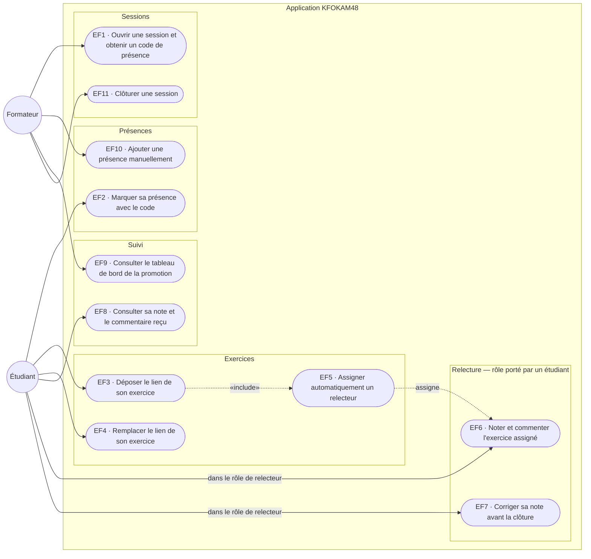

# D1 — Cas d'utilisation

> **Acteurs** : `Formateur`, `Étudiant`.
> Il n'existe **pas d'acteur « Relecteur » distinct** : un étudiant agit comme relecteur
> lorsqu'un exercice lui a été assigné (EF5 → EF6 / EF7).

