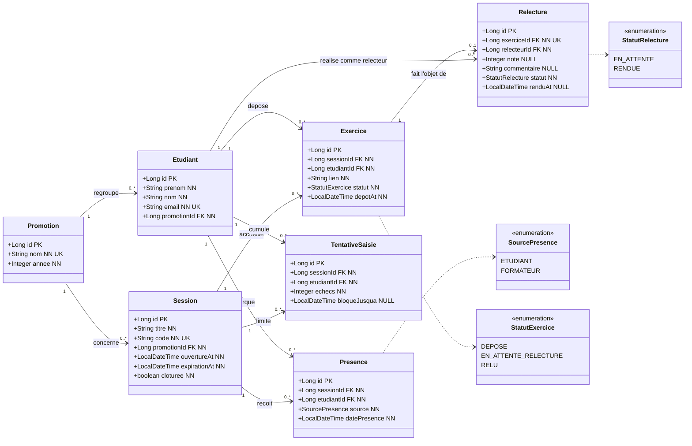

# D2 — Diagramme de classes

Modèle de données dérivé des EF1–EF11, RG1–RG14 et du contrat `api/contrat.yaml`.
Conçu pour générer directement les migrations Flyway (PostgreSQL).

## Légende des marqueurs

| Marqueur | Signification SQL |
|---|---|
| `PK` | clé primaire (`BIGINT GENERATED BY DEFAULT AS IDENTITY`) |
| `FK` | clé étrangère (`REFERENCES … ON DELETE RESTRICT`) |
| `NN` | colonne obligatoire (`NOT NULL`) |
| `UK` | colonne unique (`UNIQUE`) |
| `NULL` | colonne facultative (nullable, renseignée après coup) |

## Justification des cardinalités (par RGx)

| Relation | Cardinalité | Justification (une ligne) |
|---|---|---|
| Promotion → Etudiant | `1 — 0..*` | **EF9 + RG5** : le tableau du formateur et le pool de relecteurs sont définis à l'échelle d'une promotion. |
| Promotion → Session | `1 — 0..*` | **EF1** : une session est ouverte pour une promotion donnée (`promotionId` obligatoire dans `POST /api/sessions`). |
| Etudiant → Presence | `1 — 0..*` | **RG12** : une présence (auto ou manuelle) appartient à un étudiant ; l'unicité `(sessionId, etudiantId)` concrétise le **409 `DEJA_PRESENT`** (**RG2**). |
| Session → Presence | `1 — 0..*` | **RG1/RG2** : la présence n'existe que rattachée à une session et au code de celle-ci. |
| Etudiant → Exercice | `1 — 0..*` | **RG11** : un étudiant dépose un exercice par session ; l'unicité `(sessionId, etudiantId)` concrétise le **409 `EXERCICE_DEJA_DEPOSE`**. |
| Session → Exercice | `1 — 0..*` | **RG10** : le dépôt reste possible jusqu'à la clôture, donc l'exercice est ancré à la session. |
| Exercice → Relecture | `1 — 0..1` | **RG5** : un exercice a **un seul** relecteur, donc au plus une relecture (`exerciceId` `UNIQUE`). |
| Etudiant → Relecture | `1 — 0..*` | **RG5 + RG4** : un étudiant peut relire plusieurs exercices, mais jamais le sien (`relecteurId ≠ exercice.etudiantId`). |
| Etudiant → TentativeSaisie | `1 — 0..*` | **RG3** : le compteur d'échecs de code est tenu pour un étudiant donné. |
| Session → TentativeSaisie | `1 — 0..*` | **RG3** : le blocage est cloisonné par couple `(étudiant, session)`, pas globalement. |
| Clôture de session | `—` | **RG8/RG14** : la clôture gèle le remplacement de lien (**EF4/EF11**) et la correction de note sans nécessiter de cardinalité supplémentaire. |

## Contraintes à porter dans les migrations Flyway

- **Clés primaires** : `BIGINT GENERATED BY DEFAULT AS IDENTITY` sur chaque table.
- **Clés étrangères** : `REFERENCES … ON DELETE RESTRICT` (on préserve l'historique de suivi).
- **Unicités composites** (à déclarer en contrainte de table, pas sur une colonne) :
  - `presence UNIQUE (session_id, etudiant_id)` → 409 `DEJA_PRESENT`
  - `exercice UNIQUE (session_id, etudiant_id)` → 409 `EXERCICE_DEJA_DEPOSE`
  - `relecture UNIQUE (exercice_id)` → RG5 (un seul relecteur)
  - `tentative_saisie UNIQUE (session_id, etudiant_id)` → RG3
- **Colonnes uniques simples** : `promotion.nom`, `etudiant.email`, `session.code`.
- **Contraintes de domaine** :
  - `relecture.note CHECK (note BETWEEN 0 AND 20)` → **RG7** (`NOTE_INVALIDE`)
  - `statut` / `source` : stocker en `VARCHAR` + `CHECK (… IN (…))` (portable) plutôt qu'en type `ENUM` natif PostgreSQL.
- **Index** : sur chaque colonne FK, sur `session(code)` (résolution d'un code) et sur `session(promotion_id, cloturee)`.
- **Règles non exprimables en SQL simple** (à implémenter dans les services) :
  - **RG4** : auto-relecture interdite → comparaison inter-tables `relecteur_id ≠ exercice.etudiant_id` (contrôle service, éventuellement trigger).
  - **RG14** : gel des dépôts et notes après `session.cloturee = true`.
  - **RG1** : `expiration_at = ouverture_at + 15 min` (calcul applicatif à l'ouverture).

## Correspondance contrat d'API → modèle

| Endpoint / champ contrat | Table(s) concernée(s) |
|---|---|
| `POST /api/sessions` → `code`, `ouvertureAt`, `expirationAt` | `session` |
| `POST /api/presences` → `sessionId`, `etudiantId`, `source` | `presence` |
| `POST /api/exercices` → `statut` | `exercice` |
| `POST /api/relectures/{id}` → `note`, `commentaire` | `relecture` |
| `GET /api/tableau` → `nom`, `presences`, `exercicesDeposes`, `moyenne`, `relecturesEnAttente` | agrégats `etudiant`, `presence`, `exercice`, `relecture` |
