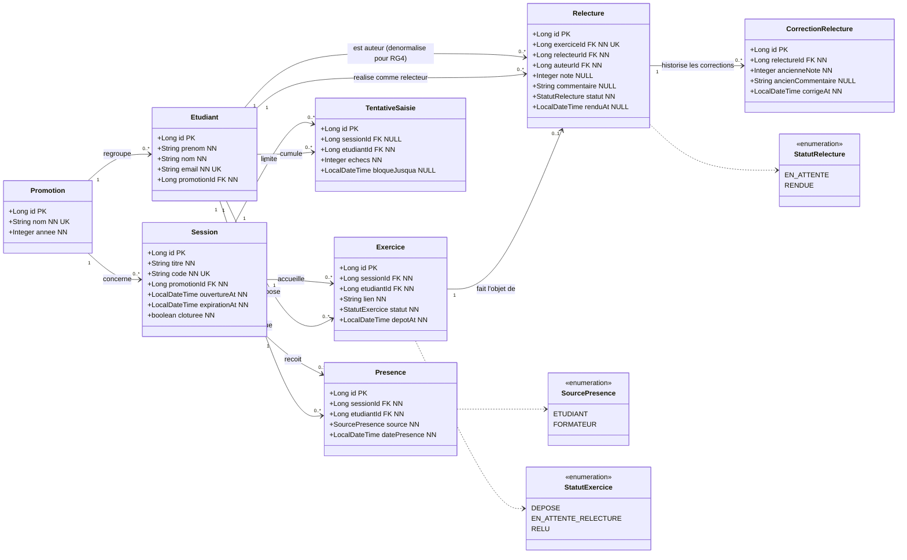

# D2 — Diagramme de classes

Modèle de données dérivé des EF1–EF11, RG1–RG14 et du contrat `api/contrat.yaml`.
Conçu pour générer directement les migrations Flyway (PostgreSQL).

## Légende des marqueurs

| Marqueur | Signification SQL |
|---|---|
| `PK` | clé primaire (`BIGINT GENERATED BY DEFAULT AS IDENTITY`) |
| `FK` | clé étrangère (`REFERENCES … ON DELETE RESTRICT`) |
| `NN` | colonne obligatoire (`NOT NULL`) |
| `UK` | colonne unique (`UNIQUE`) |
| `NULL` | colonne facultative (nullable, renseignée après coup) |



## Justification des cardinalités (par RGx)

| Relation | Cardinalité | Justification (une ligne) |
|---|---|---|
| Promotion → Etudiant | `1 — 0..*` | **EF9 + RG5** : le tableau du formateur et le pool de relecteurs sont définis à l'échelle d'une promotion. |
| Promotion → Session | `1 — 0..*` | **EF1** : une session est ouverte pour une promotion donnée (`promotionId` obligatoire dans `POST /api/sessions`). |
| Etudiant → Presence | `1 — 0..*` | **RG12** : une présence (auto ou manuelle) appartient à un étudiant ; l'unicité `(sessionId, etudiantId)` concrétise le **409 `DEJA_PRESENT`** (**RG2**). |
| Session → Presence | `1 — 0..*` | **RG1/RG2** : la présence n'existe que rattachée à une session et au code de celle-ci. |
| Etudiant → Exercice | `1 — 0..*` | **RG11** : un exercice par étudiant et par session ; l'unicité `(sessionId, etudiantId)` concrétise le **409 `EXERCICE_DEJA_DEPOSE`**. |
| Session → Exercice | `1 — 0..*` | **RG10** : le dépôt reste possible jusqu'à la clôture, donc l'exercice est ancré à la session. |
| Exercice → Relecture | `1 — 0..1` | **RG5** : un exercice a **un seul** relecteur, donc au plus une relecture (`exerciceId` `UNIQUE`). |
| Etudiant → Relecture (relecteur) | `1 — 0..*` | **RG5** : un étudiant peut relire plusieurs exercices. |
| **Etudiant → Relecture (auteur)** | `1 — 0..*` | **RG4** : `auteurId` est **dénormalisé** dans `relecture` pour rendre l'interdiction d'auto-relecture vérifiable par contrainte SQL (`CHECK relecteur_id <> auteur_id`). |
| **Relecture → CorrectionRelecture** | `1 — 0..*` | **RG8** : chaque correction avant clôture est archivée, ce qui **conserve l'historique** au lieu d'écraser la note (la note courante reste sur `relecture`). |
| Etudiant → TentativeSaisie | `1 — 0..*` | **RG3** : le compteur d'échecs est tenu pour un étudiant donné. |
| Session → TentativeSaisie | `1 — 0..*` | **RG3** : le blocage est cloisonné par couple `(étudiant, session)`, pas globalement. |

## Traçabilité RG1–RG14 → modèle / flux

| Règle | Trace dans le modèle ou le flux |
|---|---|
| **RG1** expiration 15 min | `session.expirationAt` (calcul à l'ouverture) |
| **RG2** code invalide/expiré | `session.code` + erreurs contrat `CODE_INCONNU`/`CODE_EXPIRE`/`DEJA_PRESENT` (D3) |
| **RG3** 5 échecs / 2 min | `tentative_saisie (session_id NULL, etudiant_id, echecs, bloque_jusqua)` — **deux portées** : couple (étudiant, session) pour un code expiré, étudiant seul (`session_id IS NULL`) pour un code inconnu, non rattachable à une session (`V3`) ; incrément visible en D3 |
| **RG4** pas d'auto-relecture | `relecture.auteurId` + `CHECK (relecteur_id <> auteur_id)` |
| **RG5** un seul relecteur | `relecture.exerciceId UNIQUE` + cardinalité `Exercice 1 — 0..1 Relecture` |
| **RG6** anonymat du relecteur | **non structurel** : choix de DTO sur `GET /api/etudiants/{id}/relectures-recues` (ne renvoie pas `relecteurId`) |
| **RG7** note entière 0–20 | `relecture.note` + `CHECK (note BETWEEN 0 AND 20)` + `minimum/maximum` dans le contrat |
| **RG8** correction avant clôture | `correction_relecture` (historique) + `PUT /api/relectures/{id}/correction` |
| **RG9** exercice non relu = `en attente` | `relecture.statut = EN_ATTENTE`, exposé par `GET /api/tableau.relecturesEnAttente` |
| **RG10** dépôt jusqu'à clôture | `exercice.sessionId` + contrôle `session.cloturee` (service) |
| **RG11** remplacement tant que non relu | `exercice.lien` + `PUT /api/exercices/{id}/lien` |
| **RG12** présence manuelle distinguable | `presence.source = FORMATEUR` |
| **RG13** pool recalculé à l'assignation | **non structurel** : règle de service au moment du dépôt ; aucun champ de snapshot |
| **RG14** clôture gèle dépôts/notes | `session.cloturee` + `POST /api/sessions/{id}/cloture` |

## Contraintes à porter dans les migrations Flyway

- **Clés primaires** : `BIGINT GENERATED BY DEFAULT AS IDENTITY` sur chaque table.
- **Clés étrangères** : `REFERENCES … ON DELETE RESTRICT` (on préserve l'historique de suivi).
- **Unicités** (à déclarer en contrainte de table) :
  - `presence UNIQUE (session_id, etudiant_id)` → 409 `DEJA_PRESENT`
  - `exercice UNIQUE (session_id, etudiant_id)` → 409 `EXERCICE_DEJA_DEPOSE`
  - `exercice UNIQUE (id, etudiant_id)` → **support de la FK composite de RG4**
  - `relecture UNIQUE (exercice_id)` → RG5 (un seul relecteur)
  - `tentative_saisie UNIQUE (session_id, etudiant_id)` → RG3 (les lignes `session_id IS NULL`, compteur par étudiant, ne sont pas couvertes par cet `UNIQUE` : en SQL les `NULL` sont distincts, leur unicité est donc garantie par le service — voir `V3`)
- **Contrainte d'auto-relecture (RG4)** — désormais **exprimable en SQL** :
  ```sql
  ALTER TABLE relecture
    ADD CONSTRAINT fk_relecture_exercice_auteur
      FOREIGN KEY (exercice_id, auteur_id) REFERENCES exercice (id, etudiant_id),
    ADD CONSTRAINT ck_relecture_pas_auto_relecture
      CHECK (relecteur_id <> auteur_id);
  ```
- **Contraintes de domaine** :
  - `relecture.note CHECK (note BETWEEN 0 AND 20)` → **RG7** (`NOTE_INVALIDE`)
  - `statut` / `source` : `VARCHAR` + `CHECK (… IN (…))` (portable) plutôt que type `ENUM` PostgreSQL.
- **Index** : chaque colonne FK, `session(code)`, `session(promotion_id, cloturee)`, `relecture(relecteur_id, statut)`.
- **Règles restant applicatives** (non exprimables en SQL simple) :
  - **RG14** : gel des dépôts et notes après `session.cloturee = true`.
  - **RG1** : `expiration_at = ouverture_at + 15 min`.
  - **RG13** : recalcul du pool des relecteurs à l'instant de l'assignation.
  - **RG6** : filtrage du `relecteurId` dans le DTO de sortie.

## Correspondance contrat d'API → modèle

| Endpoint | EF | Table(s) concernée(s) |
|---|---|---|
| `POST /api/sessions` (imposé) | EF1 | `session` |
| `POST /api/presences` (imposé) | EF2 | `presence` |
| `POST /api/exercices` (imposé) | EF3 | `exercice` |
| `POST /api/relectures/{id}` (imposé) | EF6 | `relecture` |
| `GET /api/tableau` (imposé) | EF9 | agrégats `etudiant`, `presence`, `exercice`, `relecture` |
| `PUT /api/exercices/{id}/lien` | EF4 | `exercice` |
| `POST /api/sessions/{id}/cloture` | EF11 | `session` |
| `PUT /api/relectures/{id}/correction` | EF7 | `relecture`, `correction_relecture` |
| `GET /api/relecteurs/{etudiantId}/relectures-en-attente` | EF6 | `relecture`, `exercice` |
| `GET /api/etudiants/{etudiantId}/relectures-recues` | EF8 | `relecture`, `exercice` |
| `POST /api/presences/manuelles` | EF10 | `presence` |

> **EF5** (assignation automatique d'un relecteur) n'a volontairement **aucun endpoint** : c'est un effet de bord du dépôt d'exercice (`POST /api/exercices`), conformément à RG5/RG13.

> **EF6** (note et commentaire rendus) écrit **deux** transitions dans la même transaction : `relecture.statut` passe de `EN_ATTENTE` à **`RENDUE`** et `exercice.statut` de `EN_ATTENTE_RELECTURE` à **`RELU`**. Ce sont deux énumérations distinctes (`StatutRelecture` et `StatutExercice`, enchaînées par D4) : `RENDUE` qualifie la relecture, `RELU` l'exercice. Une seconde note sur la même relecture est refusée en `409 RELECTURE_DEJA_RENDUE` ; sa correction relève de RG8 (`correction_relecture`, EF7).
