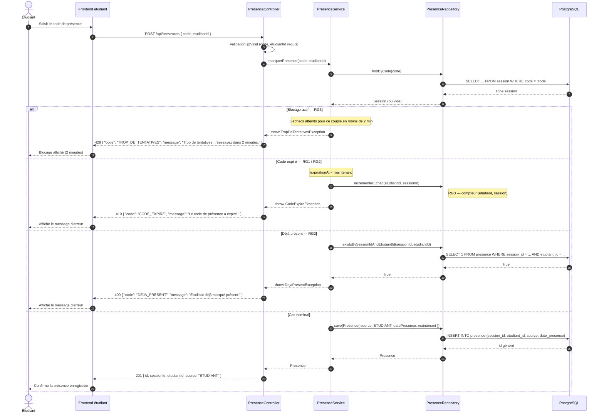

# D3 — Séquence : « marquer sa présence »

Cas d'usage : **EF2 — L'étudiant marque sa présence avec un code**.
Endpoint imposé : `POST /api/presences` (`{ code, etudiantId }`).
Règles couvertes : **RG1** (expiration 15 min), **RG2** (code invalide/expiré refusé), **RG3** (blocage après 5 échecs).

Format d'erreur imposé : `{ "code": "...", "message": "..." }`.

## Codes de statut couverts

| Branche | Statut | `code` | Origine |
|---|---|---|---|
| Blocage actif (5 échecs / 2 min) | `429` | `TROP_DE_TENTATIVES` | **RG3** |
| Cas nominal | `201` | — | **EF2** : `source = ETUDIANT` |
| Code expiré | `410` | `CODE_EXPIRE` | **RG1** (expiration 15 min) + **RG2** |
| Déjà présent | `409` | `DEJA_PRESENT` | **RG2** (unicité `(sessionId, etudiantId)`) |

## Points de vigilance

- **RG3 (blocage) — tranché** : le contrôle du blocage s'effectue **avant** la validation du code et renvoie **`429 TROP_DE_TENTATIVES`**. Le compteur d'échecs (`tentative_saisie`) est incrémenté sur tout code refusé (expiré ou inconnu) ; à 5 échecs, le couple (étudiant, session) est bloqué 2 minutes. Les codes imposés `400`/`409`/`410` restent **inchangés** : le `429` est un **ajout** documenté dans `api/contrat.yaml`.
- **Priorité des contrôles** : le diagramme évalue l'expiration **avant** l'unicité de présence ; si un code expiré concerne un étudiant déjà présent, le client reçoit `410` (et non `409`).
- **`{ code, message }`** : ce format imposé est **différent** du `ApiResponse` du socle actuel (`success/message/data/errors`). Le `GlobalExceptionHandler` devra exposer une réponse dédiée pour respecter le contrat.
- **Style** : le diagramme suit la convention du D3 existant (participants `Étudiant / Frontend / Controller / Service`). L'**Annexe C** n'étant pas fournie dans le contexte, je m'aligne sur ce style — dis-moi si elle impose une autre convention (noms de participants, `Note`, `rect`).
