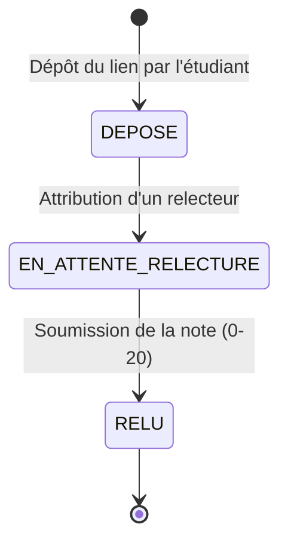

# D4 — Cycle de vie d'un exercice

## Implémentation (issue #10 — EF3, `POST /api/exercices`)

- **Statut initial** : `DEPOSE`, décidé par le service au dépôt. Le client ne fournit jamais de statut.
- **RG10 — dépôt jusqu'à la clôture** : le service de dépôt ne consulte **jamais** `session.expiration_at`. Un exercice reste déposable après l'expiration du code de présence (couvert par un test unitaire et un test d'intégration dédiés).
- **RG14 — gel à la clôture** : lorsque `session.cloturee = true`, le dépôt est refusé en `409 SESSION_CLOTUREE`, avant tout enregistrement.
- **Transition `DEPOSE → EN_ATTENTE_RELECTURE`** : **non implémentée ici**, elle relève de l'**EF5** (issue #11) : voir la section EF5 ci-dessous. Rien ne fait donc évoluer le statut au-delà de `DEPOSE` à l'issue de l'issue #10.

## Implémentation (issue #11 — EF5, `POST /api/exercices` + `GET /api/exercices/{exerciceId}/relecteur`)

- **Relecteur attribué ⇒ `EN_ATTENTE_RELECTURE`** : au dépôt, un relecteur est tiré parmi les étudiants **présents à la session**, l'auteur exclu (RG5, RG13, RG4 — algorithme dans `RelectureService`). La transition de D4 est alors franchie.
- **Aucun étudiant éligible ⇒ l'exercice reste `DEPOSE`**, sans relecteur attaché. La garde de la transition est « Attribution d'un relecteur » : sans relecteur, un exercice ne peut pas être *en attente de relecture*.
- **Équivalence `DEPOSE` ⟺ aucune relecture** : elle reste vraie, et c'est elle qui rend le cas « remplaçable » de RG11 (EF4) reconnaissable au seul statut — un lien n'est remplaçable que tant qu'aucune relecture n'a été confiée. L'EF4 vérifie malgré tout l'existence de la relecture plutôt que de déduire l'état du statut (voir la section issue #16). Conséquence pour le tableau (EF9) : `DEPOSE` et `EN_ATTENTE_RELECTURE` sont l'un comme l'autre « non rendus » et doivent apparaître en attente (RG9).

## Implémentation (issue #12 — EF6, `POST /api/relectures/{id}`)

- **Transition `EN_ATTENTE_RELECTURE → RELU`** : réalisée par la soumission de la note, dans la même transaction que l'écriture de la relecture. Une relecture `RENDUE` associée à un exercice resté « en attente » serait incohérente.
- **`RENDUE` n'est pas un état de l'exercice** : c'est le statut de la **relecture** (D2). L'opération répond `200` et non `201`, la relecture préexistant à la note.
- **`RELU` ne publie rien** : l'étudiant relu n'accède à sa note que par l'EF8 (`GET /api/etudiants/{etudiantId}/relectures-recues`), qui ne divulgue jamais l'identité du relecteur.
- **Correction ultérieure** : une seconde note sur la même relecture est refusée en `409 RELECTURE_DEJA_RENDUE` ; la correction avant clôture relève de l'EF7 (`PUT /api/relectures/{id}/correction`, RG8).

## Implémentation (issue #13 — EF8, `GET /api/etudiants/{etudiantId}/relectures-recues`)

- **Aucune transition d'état** : `RELU` est un état terminal (diagramme ci-dessus) ; EF8 ne fait que le **lire**, en lecture seule, sans modifier ni l'exercice ni la relecture. C'est la contrepartie annoncée par la section EF6 : `RELU` ne publie rien, c'est cette opération qui expose la note à l'étudiant relu.
- **RG9 — « en attente » plutôt qu'ignoré** : tant que la relecture est `EN_ATTENTE`, l'étudiant voit son exercice avec une note nulle (état intermédiaire préexistant du diagramme) ; une fois `RENDUE`, il voit la note et le commentaire.
- **Un exercice sans relecture n'apparaît pas** : l'opération liste les relectures de l'étudiant, pas ses exercices. C'est l'équivalence `DEPOSE` ⟺ aucune relecture (section EF5) qui produit ce cas ; l'exercice n'est pas perdu pour autant, il figure comme « non rendu » dans le tableau (RG9).

## Implémentation (issue #16 — EF4, `PUT /api/exercices/{id}/lien`)

- **Aucune transition d'état** : remplacer un lien ne fait pas bouger l'exercice. Le seul état où RG11 l'autorise est `DEPOSE`, et l'exercice y **reste** (`DEPOSE → DEPOSE`) ; la réponse `200 {id, statut}` renvoie donc le même statut qu'au dépôt.
- **La fenêtre de RG11 est celle du statut `DEPOSE`** : `EN_ATTENTE_RELECTURE` (relecture assignée) et `RELU` (relecture rendue) refusent le remplacement en `409 RELECTURE_COMMENCEE`. Une relecture est « commencée » dès son assignation, c'est-à-dire dès qu'une ligne `relecture` existe — le modèle ne connaissant pas d'état intermédiaire entre `EN_ATTENTE` et `RENDUE`.
- **La clôture ferme la fenêtre** : `409 SESSION_CLOTUREE` (RG14), contrôlé avant l'état de la relecture. La transition `DEPOSE → EN_ATTENTE_RELECTURE` étant elle aussi fermée après clôture, un exercice `DEPOSE` reste `DEPOSE`, mais son lien ne peut plus être corrigé.

## Implémentation (issue #17 — EF7, `PUT /api/relectures/{id}/correction`)

- **Aucune transition d'état** : la correction remplace le contenu de la note, pas le statut. `RELU` reste terminal, et `relecture.statut` reste `RENDUE` — une correction n'est pas un second rendu, `rendu_at` n'est pas réécrit.
- **Ce qui change est ailleurs que dans cet automate** : la note précédente part dans `correction_relecture` (RG8), pendant que la note courante reste sur `relecture`. C'est ce qui permet de corriger sans perdre la trace de l'évaluation initiale.
- **`RENDUE → RELU` n'est pas rejoué** : l'exercice était déjà `RELU` et le reste. Seul l'EF6 franchit cette transition.
- **La clôture ferme la correction** : `EN_ATTENTE_RELECTURE → RELU` est déjà infranchissable après clôture (section EF11), et l'EF7 y ajoute le gel du contenu — une note `RELU` corrigée après la clôture rendrait le gel de l'EF11 purement décoratif.

## Implémentation (issue #15 — EF11, `POST /api/sessions/{id}/cloture`)

- **`EN_ATTENTE_RELECTURE → RELU` devient infranchissable** : la clôture fait refuser `rendre` en `409 SESSION_CLOTUREE`, donc la transition de l'EF6 n'est plus atteignable. `RELU` reste un état terminal.
- **`DEPOSE → EN_ATTENTE_RELECTURE` est fermée aussi** : le dépôt est refusé **avant** l'assignation, donc aucune relecture nouvelle n'est créée après la clôture.
- **Aucune transition nouvelle** : la clôture ne change pas le statut d'un exercice. Un exercice resté `EN_ATTENTE_RELECTURE` — ou `DEPOSE` — le reste définitivement, ce qui rend vérifiable la règle « ces relectures restent en attente ».
- **Le gel porte sur les transitions, pas sur les données** : ni le statut, ni la note, ni le lien déjà enregistrés ne sont modifiés ; seules les transitions entrantes sont fermées.

## Étape 2 — Implémentation de la v0.1

* **Fait :** Initialisation des projets Spring Boot (Java 17) et React, création de la migration Flyway `V1__init_schema.sql`, implémentation de la gestion centralisée des erreurs API, mise en place des endpoints `/api/presences`, `/api/exercices` et `/api/tableau`, ainsi que le développement des 3 vues frontend.

* **Bloqué :** Gestion de l'attribution aléatoire d'un relecteur lors du dépôt d'un exercice lorsqu'aucun étudiant n'est encore enregistré. Le problème a été résolu par une attribution différée lors de la requête de relecture.

* **IA :** Utilisation de l'IA pour générer le boilerplate du `GlobalExceptionHandler` et du schéma Flyway SQL. Le code généré a ensuite été vérifié et aligné avec `contrat.yaml` et les exigences ENF2.
