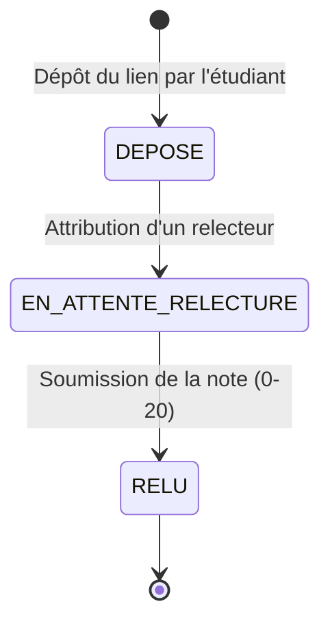

# D4 — Cycle de vie d'un exercice

## Implémentation (issue #10 — EF3, `POST /api/exercices`)

- **Statut initial** : `DEPOSE`, décidé par le service au dépôt. Le client ne fournit jamais de statut.
- **RG10 — dépôt jusqu'à la clôture** : le service de dépôt ne consulte **jamais** `session.expiration_at`. Un exercice reste déposable après l'expiration du code de présence (couvert par un test unitaire et un test d'intégration dédiés).
- **RG14 — gel à la clôture** : lorsque `session.cloturee = true`, le dépôt est refusé en `409 SESSION_CLOTUREE`, avant tout enregistrement.
- **Transition `DEPOSE → EN_ATTENTE_RELECTURE`** : **non implémentée ici**. L'assignation d'un relecteur est un effet de bord du dépôt, mais elle relève de l'**EF5** (issue #11) ; c'est pourquoi rien ne fait encore évoluer le statut au-delà de `DEPOSE`.

## Étape 2 — Implémentation de la v0.1

* **Fait :** Initialisation des projets Spring Boot (Java 17) et React, création de la migration Flyway `V1__init_schema.sql`, implémentation de la gestion centralisée des erreurs API, mise en place des endpoints `/api/presences`, `/api/exercices` et `/api/tableau`, ainsi que le développement des 3 vues frontend.

* **Bloqué :** Gestion de l'attribution aléatoire d'un relecteur lors du dépôt d'un exercice lorsqu'aucun étudiant n'est encore enregistré. Le problème a été résolu par une attribution différée lors de la requête de relecture.

* **IA :** Utilisation de l'IA pour générer le boilerplate du `GlobalExceptionHandler` et du schéma Flyway SQL. Le code généré a ensuite été vérifié et aligné avec `contrat.yaml` et les exigences ENF2.
